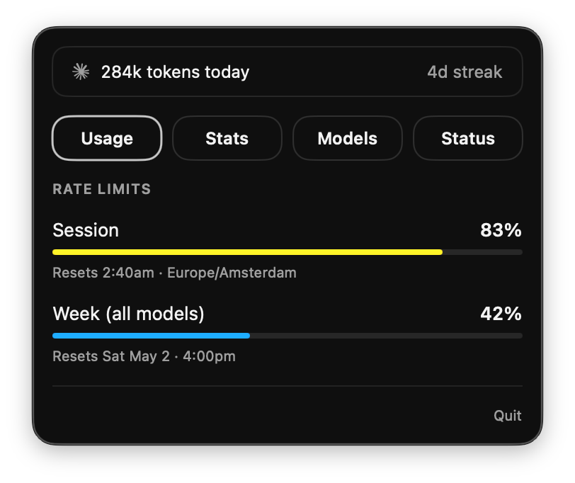
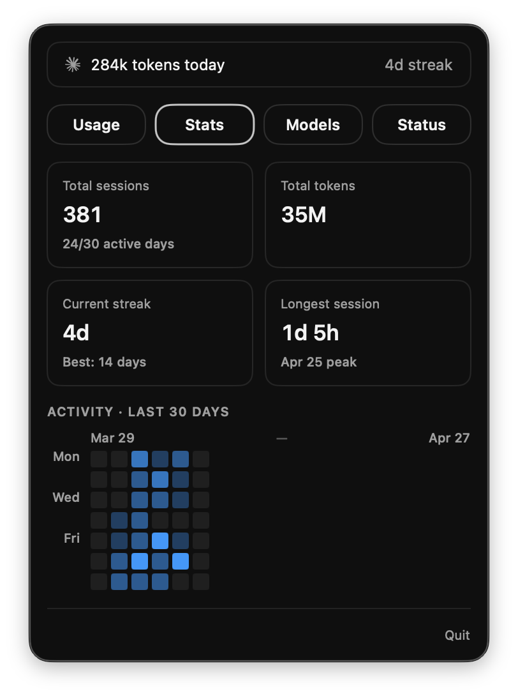
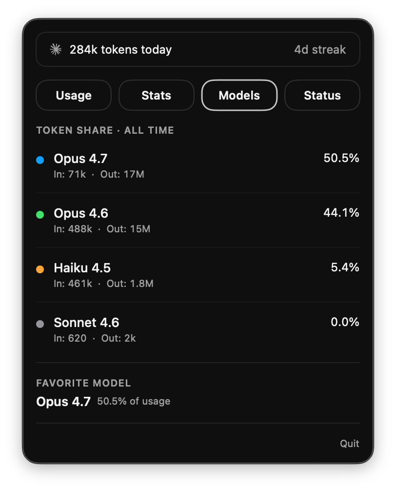
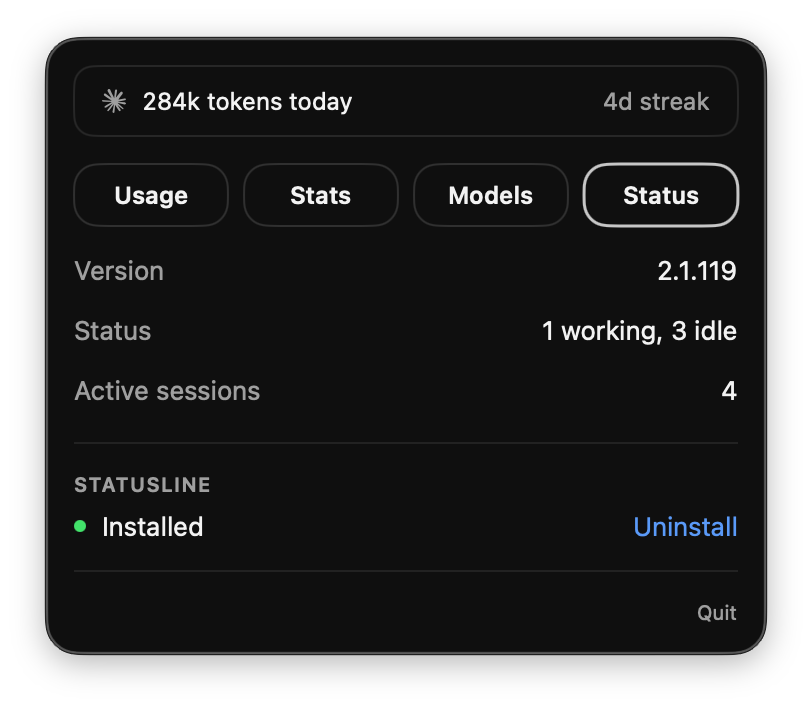

# ClaudeBar

A macOS menu bar app that surfaces Claude Code usage at a glance — session and weekly rate limits, daily/total token stats, model breakdown, active sessions. Posts a notification when a limit crosses 80% or 100%.

| Usage | Stats |
|---|---|
|  |  |
| **Models** | **Status** |
|  |  |

## Install

```sh
make install
```

Builds a Release copy, quits any running instance, copies the app to `/Applications/ClaudeBar.app`, and launches it. Run `make help` for other targets (`generate`, `build`, `package`, `clean`, ...).

## First-time setup

After launching, open the **Status** tab and click **Install statusline**. This writes a small relay script to `~/.claude/claudebar-statusline.sh` and points `~/.claude/settings.json` at it. The relay runs on every Claude Code prompt, captures the rate-limit headers, and writes them to `~/.claude/rate-limits.json`. ClaudeBar watches that file and updates live.

If you already have a custom statusline configured, ClaudeBar will detect it and offer to replace it (your previous command is shown so you can restore it later).

## Data sources

- `~/.claude/stats-cache.json` — totals, daily activity, model usage (Stats + Models tabs)
- `~/.claude/rate-limits.json` — written by the statusline relay (Usage tab)
- `~/.claude/sessions/*.json` — active sessions (Status tab)

## Development

```sh
xcodegen generate
open ClaudeBar.xcodeproj
```

```sh
xcodebuild -project ClaudeBar.xcodeproj -scheme ClaudeBar -configuration Debug test
```

## Layout

- `ClaudeBar/ClaudeBarApp.swift` — app entry, `MenuBarExtra` wiring
- `ClaudeBar/Views/` — popover, header, tab bar, four tab views, reusable components
- `ClaudeBar/Services/` — file readers (`StatsCache`, `RateLimits`, `Sessions`), `ClaudeFileWatcher`, `StatuslineInstaller`, `ThresholdTracker`, `NotificationCoordinator`
- `ClaudeBar/DesignSystem/` — `Theme`, `ViewModifiers`
